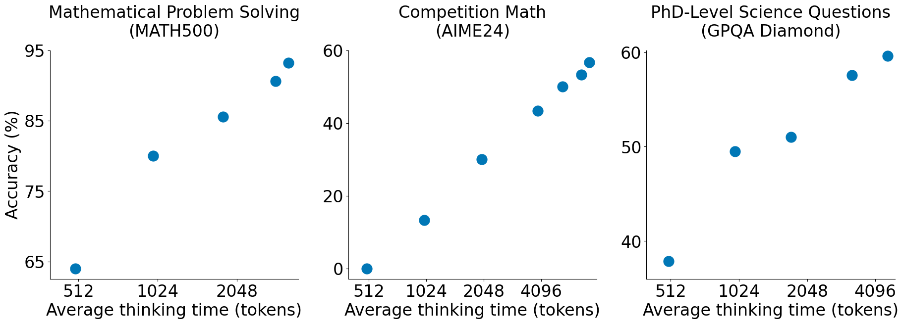

已经把参数改成cpu也能自动适配的了. 运行2.py即可.都不需要手动改.


第一步运行:data/fix_gpqa.py     data/add_aime.py  data/collect_data.py   data/gemini.py
data/bulk_inference.py  ata/featurization.py  data/filter.ipynb 最后得到了数据集 ("qfq/s1K_tokenized") 也传到了hf上. 更好的是 simplescaling/s1K-1.1     simplescaling/s1K-1.1_tokenized 这个是添加了tokenized提示词的.

把simplescaling/s1K-1.1_tokenized  和  simplescaling/s1K-1.1 区别写一下:

1.1数据字段:
solution


stringlengths
16.9k
----------

question


stringlengths
402.42k
-----------

cot_type


stringclasses
3 values
---------
source_type


stringclasses
34 values
--------
metadata


stringlengths
219.4k
--------
gemini_thinking_trajectory


stringlengths
1.47k25.4k
---------
gemini_attempt


stringlengths
99.82k
------
deepseek_thinking_trajectory


stringlengths
2.33k80.3k
------
deepseek_attempt

stringlengths
2.33k80.3k

1.1 tokenized数据字段:
就是上面这些字段加了一个text字段. 
所以我们最终使用的数据就是https://huggingface.co/datasets/simplescaling/s1K-1.1_tokenized


一些数学符号的说明.

三种空格unicode(\u00A0,\u0020,\u3000) 原创

CSDN博客
https://blog.csdn.net › article › details
2020年6月24日 — - “00A0”：“\u00A0”表示不换行空格（non-breaking space


{"question": "Let $\mathbb{R}$ be the set of real numbers .  Determine all functions $f \u00a0:\mathbb{R} \rightarrow \mathbb{R}$ such that\n  \nfor all pairs of real numbers $x$ and $y$ ."}

{"question": "Find the sum of the ages of everyone who wrote a problem for this year's HMMT November contest. If your answer is $X$ and the actual value is $Y$, your score will be $\max (0,20-|X-Y|)$"}


<div align="center">
  <h1>s1: Simple test-time scaling</h1>
  <p>Minimal recipe for test-time scaling and strong reasoning performance matching o1-preview with just 1,000 examples & budget forcing
 </p>
</div>
<br>



****************************************************************

**Updates:**

* 2025-02: We released [s1.1](https://huggingface.co/simplescaling/s1.1-32B) a better model than s1 by reusing the same s1K questions but with reasoning traces generated by r1 instead of Gemini: [s1K-1.1](https://huggingface.co/datasets/simplescaling/s1K-1.1). Check [this tweet](https://x.com/Muennighoff/status/1889310803746246694) for details
* 2025-01: We released [our paper](https://arxiv.org/abs/2501.19393) announced via [this tweet](https://x.com/Muennighoff/status/1886405528777073134).

****************************************************************

This repository provides an overview of all resources for the paper ["s1: Simple test-time scaling"](https://arxiv.org/abs/2501.19393).

- [Artifacts](#artifacts)
- [Structure](#structure)
- [Inference](#inference)
  - [vLLM](#vllm)
  - [vLLM with budget forcing](#vllm-with-budget-forcing)
  - [transformers](#transformers)
- [Training](#training)
- [Evaluation](#evaluation)
- [Data](#data)
- [Visuals](#visuals)
- [Known Issues](#known-issues)
- [Citation](#citation)

### Artifacts

- **Paper**: https://arxiv.org/abs/2501.19393
- **Model**: https://hf.co/simplescaling/s1-32B
- **Data**: https://hf.co/datasets/simplescaling/s1K
    - s1-prob: https://hf.co/datasets/simplescaling/s1-prob
    - s1-teasers: https://hf.co/datasets/simplescaling/s1-teasers
    - Full 59K: https://hf.co/datasets/simplescaling/data_ablation_full59K

### Structure

- `eval/`: Evaluation scripts
- `data/`: Synthetic data creation scripts & co
- `train/`: Training scripts

### Inference

#### vLLM
#一般的llm调用.
Install the `vllm` library and run:
```python
from vllm import LLM, SamplingParams
from transformers import AutoTokenizer

model = LLM(
    "simplescaling/s1.1-32B",
    tensor_parallel_size=2,
)
tok = AutoTokenizer.from_pretrained("simplescaling/s1-32B")

stop_token_ids = tok("<|im_end|>")["input_ids"]

sampling_params = SamplingParams(
    max_tokens=32768,
    min_tokens=0,
    stop_token_ids=stop_token_ids,
)

prompt = "How many r in raspberry"
prompt = "<|im_start|>system\nYou are Qwen, created by Alibaba Cloud. You are a helpful assistant.<|im_end|>\n<|im_start|>user\n" + prompt + "<|im_end|>\n<|im_start|>assistant\n"

o = model.generate(prompt, sampling_params=sampling_params)
print(o[0].outputs[0].text)
```

#### vLLM with budget forcing
# 带有预算强制的调用
```python
from vllm import LLM, SamplingParams
from transformers import AutoTokenizer

# Decide on a token limit for thinking; As the model's max tokens is 32768, 32000 usually ensures there is enough space for the model to still answer
MAX_TOKENS_THINKING = 32000
# Decide how often to ignore end-of-thinking token
NUM_IGNORE = 1

model = LLM(
    "simplescaling/s1-32B", # s1 originally gets this prompt wrong but with budget forcing it fixes it
    tensor_parallel_size=2,
)
tok = AutoTokenizer.from_pretrained(
    "simplescaling/s1-32B"
)

stop_token_ids = tok("<|im_end|>")["input_ids"] # 结束符的索引
sampling_params = SamplingParams(
    max_tokens=32768,
    min_tokens=0,
    stop_token_ids=stop_token_ids,
    skip_special_tokens=False,
    temperature=0.0,
)

# For the exact raspberry sample in the paper see
prompts = [
    "How many r in raspberry",
]

for i, p in enumerate(prompts):
    prompt = "<|im_start|>system\nYou are Qwen, created by Alibaba Cloud. You are a helpful assistant.<|im_end|>\n<|im_start|>user\n" + p + "<|im_end|>\n<|im_start|>assistant\n"
    stop_token_ids = tok("<|im_start|><|im_end|>")["input_ids"]
    sampling_params = SamplingParams(
        max_tokens=MAX_TOKENS_THINKING,
        min_tokens=0,
        stop_token_ids=stop_token_ids,
        skip_special_tokens=False,
        temperature=0.0,
    )
    prompt += "<|im_start|>think"
    o = model.generate(#先让他生成最长3w2的句子.
        prompt,
        sampling_params=sampling_params
    )
    ignore_str = "Wait"
    max_tokens_thinking_tmp = MAX_TOKENS_THINKING
    # Num of times to skip stop token
    for i in range(NUM_IGNORE): # NUM_IGNORE 表示跳过stop token的次数.
        max_tokens_thinking_tmp -= len(o[0].outputs[0].token_ids)# 先计算还剩多少个思考token
        prompt += o[0].outputs[0].text + ignore_str # 第二次生成的提示词是第一次的提示词添加上第一次生成的结果, 再加上ignore_str 也就是wait这个字符串.
        sampling_params = SamplingParams( # 进行第二次生成的参数.
            max_tokens=max_tokens_thinking_tmp,
            min_tokens=1,
            stop_token_ids=stop_token_ids,
            skip_special_tokens=False,
            temperature=0.0,
        )
        o = model.generate(
            prompt,
            sampling_params=sampling_params
        )
    ### Final answer ###
    prompt += o[0].outputs[0].text # You can also append "Final Answer:" here like we do for some evaluations to prevent the model from just continuing to reason in its answer when early exiting
    stop_token_ids = tok("<|im_end|>")["input_ids"]
    sampling_params = SamplingParams(
        max_tokens=32768,
        min_tokens=0,
        stop_token_ids=stop_token_ids,
        skip_special_tokens=False,
        temperature=0.0,
    )
    o = model.generate(#再次生成.
        prompt,
        sampling_params=sampling_params,
    )
    print("With budget forcing:") # You will see that after the "Wait" in the reasoning trace it fixes its answer
    print(prompt + o[0].outputs[0].text)
```

#### transformers

Install the `transformers` & `torch` libraries and run:

```python
from transformers import AutoModelForCausalLM, AutoTokenizer
import torch

DEVICE = "cuda" if torch.cuda.is_available() else "cpu"
model_name = "simplescaling/s1.1-32B"

model = AutoModelForCausalLM.from_pretrained(
    model_name,
    torch_dtype="auto",
    device_map="auto"
)
tokenizer = AutoTokenizer.from_pretrained(model_name)

prompt = "How many r in raspberry"
messages = [
    {"role": "system", "content": "You are a helpful and harmless assistant. You are Qwen developed by Alibaba. You should think step-by-step."},
    {"role": "user", "content": prompt}
]
text = tokenizer.apply_chat_template(
    messages,
    tokenize=False,
    add_generation_prompt=True
)
model_inputs = tokenizer([text], return_tensors="pt").to(model.device)

generated_ids = model.generate(
    **model_inputs,
    max_new_tokens=512
)
generated_ids = [
    output_ids[len(input_ids):] for input_ids, output_ids in zip(model_inputs.input_ids, generated_ids)
] #保留生成的中的原始prompt就有的部分.

response = tokenizer.batch_decode(generated_ids, skip_special_tokens=True)[0]
```

### Training


To run training, you can find our script at `train/sft.py` which you can invoke via one of the `train/sft*sh` scripts which in turn you can launch via `train/launch.sh` if you are on a SLURM cluster (requires editing the file for your cluster setup).

To train s1-32B/s1.1-32B, we recommend 16 H100 GPUs i.e. 2 nodes with 8 each. For s1.1, we set the block size to 20000 to avoid OOM (https://github.com/simplescaling/s1/blob/0ad4b3de32507b4aa0d4be28f336276ee99b2315/train/sft.sh#L17); Check the wandb logs [here](https://wandb.ai/hashimoto-group/o1/runs/m1ilia77/overview).

Quick start:
```
git clone https://github.com/simplescaling/s1.git
cd s1
pip3 install -r requirements.txt
bash train/sft.sh
```
*Note: If you encounter an out-of-memory (OOM) issue with 8 GPUs, consider enabling gradient checkpointing by adding the following line to your script: `--gradient_checkpointing=True`.*

### Evaluation

We cloned [lm-evaluation-harness](https://github.com/EleutherAI/lm-evaluation-harness) at commit `4cec66e4e468d15789473d6d63c3a61a751fa524` and modified it. Setup:
```bash
cd eval/lm-evaluation-harness
pip install -e .[math,vllm]
```

All commands are in `eval/commands.sh`. For AIME24 we always pick the `aime24_nofigures` result, which uses a dataset that only contains the AIME24 figures if they are important for the task.

If you want to compute statistics (avg thinking tokens etc) for an evaluation run you can use 
`python eval/compute_sample_stats.py path_to_samples_file.jsonl`

All our evaluation result files are at: https://hf.co/datasets/simplescaling/results

To run REBASE: commands are in `eval/rebase/run.sh`
Note that for the evaluations in the Discussion section with REBASE we used https://huggingface.co/simplescaling/step-conditional-control-old trained on an older version of our dataset https://huggingface.co/datasets/simplescaling/s1K-step-conditional-control-old and run on an older version of our evaluation using https://huggingface.co/datasets/Maxwell-Jia/AIME_2024.

### Data

To recreate s1K follow the steps below. In various files you will have to rename the organizations `simplescaling` and `qfq` with an organization that you own. **Note that [s1K-1.1](https://huggingface.co/datasets/simplescaling/s1K-1.1) is a better dataset generated with r1 traces instead of Gemini traces.**
1. Run `data/collect_data.py` followed by `data/fix_gpqa.py` & `data/add_aime.py` to collect the questions; Make sure to change the hub path in the respective files to one of your own
3. Generate traces with Gemini via `python data/gemini.py`.
4. Generate answers with Qwen via `python data/bulk_inference.py` that can be launched with `data/bulk_inference.sh`.
5. Add features by running `python data/featurization.py`.
6. Run final filtering via going through `data/filter.ipynb`.

### Visuals

All figures and some tables are created via [this colab](https://colab.research.google.com/drive/1GAfwbJs2Y1dgGGsxrQyQg2G7CRH5NgN3?usp=sharing) equivalent to `visuals/visuals.ipynb`. Some are subsequently edited via the `visuals/s1.fig` file, which you can load in Figma.

### Known Issues

- vLLM throws `ValueError: Token id XXXXX is out of vocabulary`
  - This can happen with budget forcing, especially when running with temperature 1, where the model will sometimes do crazy stuff and predict a vocab id that is larger than its max token id but still within its embedding size i.e. anything <152064, >151664; When we refeed the model's previous outputs to it which is done when setting e.g. max_thinking_tokens in the evaluation then this will cause the error cuz vLLM does this check even though it would only be an issue for IDs >152064. To fix it you can just uncomment the vLLM ValueError (It is the line `if max_input_id > tokenizer.max_token_id:` in `vllm/engine/llm_engine.py`)

### Citation

```bibtex
@misc{muennighoff2025s1simpletesttimescaling,
      title={s1: Simple test-time scaling}, 
      author={Niklas Muennighoff and Zitong Yang and Weijia Shi and Xiang Lisa Li and Li Fei-Fei and Hannaneh Hajishirzi and Luke Zettlemoyer and Percy Liang and Emmanuel Candès and Tatsunori Hashimoto},
      year={2025},
      eprint={2501.19393},
      archivePrefix={arXiv},
      primaryClass={cs.CL},
      url={https://arxiv.org/abs/2501.19393}, 
}
```
"# train_simplescaling-s1K-1.1" 
